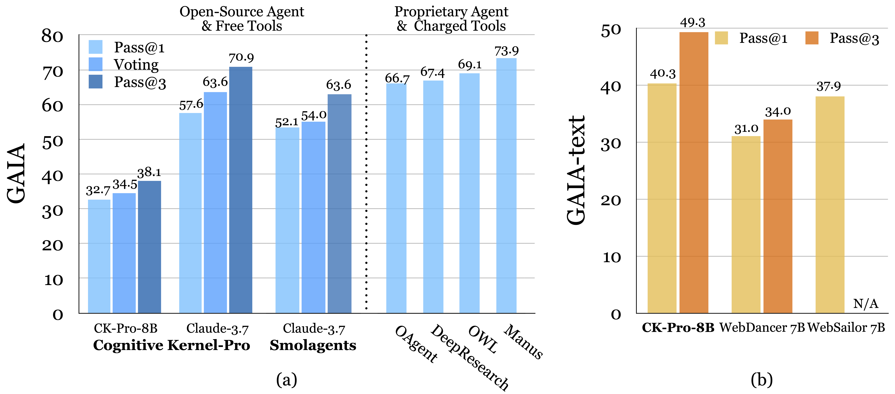

# Cognitive Kernel-Pro: A Framework for Deep Research Agents and Agent Foundation Models Training


[](https://arxiv.org/abs/2508.00414) [](https://huggingface.co/datasets/CognitiveKernel/CognitiveKernel-Pro-Query) [](https://huggingface.co/CognitiveKernel/Qwen3-8B-CK-Pro)

<!-- [](https://opensource.org/licenses/MIT)  -->

<p align="center"></p>

- A state-of-the-art open-source agent utilizing (as many as possible) free tools; the only paid tool is the Google Search API, which can be replaced with the free DuckDuckGo API if needed.
- Fully reproducible open-source SFT training recipe that outperforms RL-based models like WebDancer and WebSailor—no RL required.


## Running Cognitive Kernel-Pro (CogKernel-Pro for short) Agent

### Environment

#### Python
- python3.12 is recommended
- Dependency:

```bash
pip install boto3 botocore openai duckduckgo_search rich numpy openpyxl biopython mammoth markdownify pandas pdfminer-six python-pptx pdf2image puremagic pydub SpeechRecognition bs4 youtube-transcript-api requests transformers protobuf openai langchain_openai langchain
pip install selenium helium smolagents
```

#### Web Server (Powered by Playwright)

- **On Linux**:

  - Checkout the script for hosting the web engine [./ck_web/_web/run_local.sh](./ck_web/_web/run_local.sh).
  - Dependency:
  ```bash
  apt-get install -y poppler-utils default-jre libreoffice-common libreoffice-java-common libreoffice ffmpeg
  # for ck_web
  sh ck_pro/ck_web/_web/run_local.sh
  ```
  - **IMPORTANT**: it is recommended to run this program in a sandbox since the generated python code is directly executed and currently there are no safety checkings. (Disable sudo for your user to ensure safety.)
  ```bash
  # run with root
  echo "${USER}" 'ALL=(ALL) NOPASSWD: !ALL' | tee /etc/sudoers.d/${USER}-rule
  chmod 440 /etc/sudoers.d/${USER}-rule
  deluser ${USER} sudo
  hostnamectl set-hostname localhost
  ```
- **On Mac**:
  - Checkout the script for hosting the web engine [./ck_web/_web/run_local_mac.sh](./ck_web/_web/run_local_mac.sh)
  - Dependency：
  ```zsh
  brew install --cask libreoffice
  brew install poppler
  brew install ffmpeg
  # for ck_web
  sh ck_pro/ck_web/_web/run_local_mac.sh
  ```
  - **IMPORTANT**: it is recommended to run this program in a sandbox since the generated python code is directly executed and currently there are no safety checkings. (Disable sudo for your user to ensure safety.)
  ```bash
  # run with root
  echo "${USER}" 'ALL=(ALL) NOPASSWD: !ALL' | tee /etc/sudoers.d/${USER}-rule
  chmod 440 /etc/sudoers.d/${USER}-rule
  dseditgroup -o edit -d "$USER" admin
  scutil --set HostName localhost
  ```

<!-- ### Running Configuration
通过一个整体的configuration-python-dictionary来指定运行参数，字典里的值直接对应类里面的item（支持hierarchy的方式）。init具体的mechanism详见`utils.py:KwargsInitializable`，简单来说是通过赋值`__dict__`来直接修改object。以下是对于`CKAgent`的一个例子：
```python
{
    "model": {"call_target": "gpt:gpt-4o-mini"},  # use gpt-4o-mini for the LLM of main agent
    "max_steps": 10,  # a maximum of 10 steps for the main agent
    "web_agent": {
        "model": {"call_target": "http://MY_VLLM:8080/v1/chat/completions"},  # use vllm service (replace MY_VLLM with your IP) for the web agent
        "web_env_kwargs": {"web_ip": "localhost:3000"},  # IP for the web-browser server
    }
}
``` -->

### Example (A simple example)
- See [`ck_main/_test`](./ck_main/_test) for a simple example and its corresponding outputs
```bash
export PYTHONPATH=/your/path/to/CogKernel-Pro
# Assume we have set up a vllm model server and a web-browser server (currently these are active: WEB_IP
WEB_IP=localhost:3001  # web-browser server
LLM_URL=http://xx.xx.xx.xx:8080/v1/chat/completions  # vllm model server
#LLM_URL=gpt:gpt-4.1  # using gpt
#VLM_URL=gpt:gpt-4.1  # using gpt
#LLM_URL=claude:  # using claude
#VLM_URL=claude:  # using claude
# run simple test
MAIN_ARGS="{'web_agent': {'model': {'call_target': '${LLM_URL}'}, 'model_multimodal': {'call_target': '${VLM_URL}'}, 'web_env_kwargs': {'web_ip': '${WEB_IP}'}}, 'file_agent': {'model': {'call_target': '${LLM_URL}'}, 'model_multimodal': {'call_target': '${VLM_URL}'}}, 'model': {'call_target': '${LLM_URL}'}}"
# use "NO_NULL_STDIN=1" for easier debugging
# you can also remove `--input` field to directly input your task from stdin
# you can also remove `-mpdb` flag to run the program directly instead of in debugging mode
NO_NULL_STDIN=1 python3 -u -mpdb -m ck_pro.ck_main.main --updates "${MAIN_ARGS}" --input /your/path/to/simple_test.jsonl --output /your/path/to/simple_test.output.jsonl |& tee _log_simple_test
less -R _log_simple_test  # use 'less -R' to see the colored outputs
```

### Example (Experimenting on the GAIA dataset)
```bash
# Step 1: prepare data
# decompress the gaia data (or you can download it by yourself from huggingface)
# -> assume all the gaia related input files are at the same DIR as the input json meta-file
unzip /your/path/to/CogKernel-Pro/Evaluation/gaia2504.zip
# Step 2: prepare web service (recommending using a PC or laptop to enable better network connection)
# -> prepare things according to "./ck_web/_web/run_local.sh"
#LISTEN_PORT=3001 npm start
#WEB_IP=localhost:3001  # web-browser server
# Step 3: prepare a vllm instance for model calling
# use gpt
#LLM_URL=gpt:gpt-4.1
#VLM_URL=gpt:gpt-4.1
#export AZURE_OPENAI_ENDPOINT="YOUR_ENDPOINT"
#export AZURE_OPENAI_API_KEY="YOUR_API_KEY"
#export AZURE_OPENAI_API_VERSION="YOUR_API_VERSION"
# or use claude
#LLM_URL=claude:  # using claude
#VLM_URL=claude:  # using claude
#export AWS_ACCESS_KEY="YOUR_KEY"
#export AWS_SECRET_ACCESS_KEY="YOUR_SECRET_KEY"
LLM_URL=http://xx.xx.xx.xx:8080/v1/chat/completions  # vllm model server
VLM_URL=http://xx.xx.xx.xx:8081/v1/chat/completions  # for VLM
# Step 4: Setup search engine
# either using google api
#export SEARCH_BACKEND="Google"
#export SEARCH_API_KEY="YOUR_API_KEY"
#export SEARCH_CSE_ID="YOUR_CSE_ID"
# or simply use DuckDuckGo
export SEARCH_BACKEND="DuckDuckGo"
# Step 5: run
export PYTHONPATH=/your/path/to/CogKernel-Pro/
#pip install ...  # see above in `Environment`
# it will be more stable to run a new web-browser for each web call, setup WEB_PORT (web browser service's port) and WEB_DIR (main dir of the web browser service)
# moreover, it is slightly better to use non-boxed screenshot (make sure to update the latest `server.js` and set screenshot_boxed=False)
WEB_DIR=/path/to/_web/  # where we put `server.js` and related `node_modules`
WEB_PORT=3001
MAIN_ARGS="{'web_agent': {'model': {'call_target': '${LLM_URL}'}, 'model_multimodal': {'call_target': '${VLM_URL}'}, 'web_env_kwargs': {'web_ip': 'localhost:${WEB_PORT}', 'web_command': 'cd ${WEB_DIR}; LISTEN_PORT=${WEB_PORT} npm start', 'screenshot_boxed': False}}, 'file_agent': {'model': {'call_target': '${LLM_URL}'}, 'model_multimodal': {'call_target': '${VLM_URL}'}}, 'model': {'call_target': '${LLM_URL}'}}"
python3.12 -u -m ck_pro.ck_main.main --updates "${MAIN_ARGS}" --input /your/path/to/gaia_dev.jsonl --output /your/path/to/gaia_dev.output.jsonl |& tee -a _log_gaia_dev

# Step 6: analyze and check the output
python -m ck_pro.ck_main.scripts.analyze -f /your/path/to/output/gaia_dev.output.jsonl -b 0
```

### Extra Running Config
```bash
# calling claude+thinking for the outside main-agent
LLM_URL=gpt:gpt-4.1  # still use gpt4.1 for sub-agents
VLM_URL=gpt:gpt-4.1
export AZURE_OPENAI_ENDPOINT="YOUR_ENDPOINT"  # find these keys in the corresponding spreadsheets
export AZURE_OPENAI_API_KEY="YOUR_API_KEY"
export AZURE_OPENAI_API_VERSION="YOUR_API_VERSION"
export AWS_ACCESS_KEY="YOUR_KEY"
export AWS_SECRET_ACCESS_KEY="YOUR_SECRET_KEY"
MAIN_ARGS="{'web_agent': {'model': {'call_target': '${LLM_URL}'}, 'model_multimodal': {'call_target': '${VLM_URL}'}, 'web_env_kwargs': {'web_ip': 'localhost:${WEB_PORT}', 'web_command': 'cd ${WEB_DIR}; LISTEN_PORT=${WEB_PORT} npm start', 'screenshot_boxed': False}}, 'file_agent': {'model': {'call_target': '${LLM_URL}'}, 'model_multimodal': {'call_target': '${VLM_URL}'}}, 'model': {'thinking': 'True', 'call_target': 'claude:', 'call_kwargs': {'temperature': 0.2, 'top_p': 0.95, 'max_tokens': 4096}}}"  # use claude+thinking for main-agent, allowing more max_token budgets
```


### Enabling Reflection 

Extra configs required:

```bash
# configuration of the evaluator LLM
export EVALUATOR_LLM=gpt:gpt-4.1
# langchain 
export AZURE_OPENAI_API_VERSION=2025-01-01-preview
export OPENAI_API_TYPE=azure_ai
export AZURE_INFERENCE_ENDPOINT=$AZURE_OPENAI_ENDPOINT
export AZURE_INFERENCE_CREDENTIAL=$AZURE_OPENAI_API_KEY
```

Extra arguments when running ck_pro.ck_main.main: `--inference-time-evaluation-method`, where you can choose from `no_answer` and `gpt_judge`. `no_answer` simply checks whether the agent have returned anything meaningful, while `gpt_judge` use the LLM specified by `EVALUATOR_LLM` to perform evaluation on the trajectory and decide whether there's a need to retry.

```bash
python -u -m ck_pro.ck_main.main --updates "${MAIN_ARGS}" --inference-time-evaluation-method gpt_judge --max_retry_num 3 --input /path/to/input --output /path/to/output
```


## Data

### Saved Data Format

目前数据格式如下：
- The class of `Session` is used to save trajectories [session.py](ck_pro/agents/session.py)
- The analysis script could help understand the data structure [analyze.py](ck_pro/ck_main/scripts/analyze.py)
```python
# one instance in one json-line
INSTANCE = {
  "id": "Task ID",
  "task": "Task Description",
  "session": {  # corresponding to the class of Session
    "id": "Session ID",
    "info": {...},  # other information such model calling token counts
    "task": "Original Task Description",
    "steps": [  # information for each step
      {
        "step_idx": 0,
        "plan": {
          "thought": "Model's thought",
          "code": "Model's output code",
          "state": {...},  # updated state
          "llm_input": [],  # model's direct input messages
          "llm_output": "Model's raw output",  # model's raw output
        },
        "action": {
          "...": ...,  # similar to plan
          # "observation": ...,  # simple outputs from code execution
          # if calling a sub-agent, we have more complex structures storing the session from the sub-agent
          "observation": {  # see the class of AgentResult
            "output": "formatted outputs",
            "log": "logs",
            "task": "Task for the sub-agent",
            "session": {...},
          },
        },
      },  # step 0
      ...,  # later steps
      {
        "...": ...,  # plan and action
        "end": {  # in the final step, we may also have an ending module if configured
          "..."  # fields are similar to plan and action
        }
      }  # final step
    ],
  },
}
```

### System Prompts

Prompts are saved in `prompts.py` files of each agent, such as [ck_pro/ck_main/prompts.py](ck_pro/ck_main/prompts.py)，[ck_web/prompts.py](ck_pro/ck_web/prompts.py).

Check out [detailed notes](ck_pro/readme.md) for more details.

## Data 

The queries and answers of Multi-hop URLQA and AgentWebQA is [here](https://huggingface.co/datasets/CognitiveKernel/CognitiveKernel-Pro-Query). The full SFT data is coming soon.

### Trajectory sampling

We use `gpt-4.1` to sample trajectories. You need to download the queries first and then run the main agent execution code that is similar to previous sections. You may add additional arguments `--sampling-mode --evaluation-method llm_score --max_retry_num 3` to sample the same query up to 3 times until it is successful. 

```bash
export LISTEN_PORT=XXXX
export WEB_IP=localhost:${LISTEN_PORT}
lsof -ti tcp:$LISTEN_PORT | xargs kill -9
export LLM_URL=gpt:gpt-4.1
export VLM_URL=gpt:gpt-4.1

export AZURE_OPENAI_API_KEY="YOUR_API_KEY"
export AZURE_OPENAI_ENDPOINT="YOUR_ENDPOINT"
export AZURE_OPENAI_API_VERSION=2025-01-01-preview
export MAX_FILE_READ_TOKENS=10000
export MAX_FILE_SCREENSHOT=5
export SEARCH_BACKEND=Google
export SEARCH_API_KEY="YOUR_GOOGLE_KEY"
export SEARCH_CSE_ID="YOUR_CSE_ID"

#langchain
export EVALUATOR_LLM=gpt:gpt-4.1
export AZURE_OPENAI_API_VERSION=2025-01-01-preview
export OPENAI_API_TYPE=azure_ai
export AZURE_INFERENCE_ENDPOINT=$AZURE_OPENAI_ENDPOINT
export AZURE_INFERENCE_CREDENTIAL=$AZURE_OPENAI_API_KEY

export MAIN_ARGS="{'web_agent': {'max_steps': 25, 'model': {'call_target': '${LLM_URL}'}, 'model_multimodal': {'call_target': '${VLM_URL}'}, 'web_env_kwargs': {'web_ip': '${WEB_IP}', 'web_command': 'cd /path/to/ck_pro/ck_web/_web; LISTEN_PORT=${LISTEN_PORT} npm start'}}, 'file_agent': {'max_steps': 20, 'model': {'call_target': '${LLM_URL}'}, 'model_multimodal': {'call_target': '${VLM_URL}'}}, 'model': {'call_target': '${LLM_URL}'}, 'max_steps': 12}"

python -u -m ckv3.ck_main.main --updates "${MAIN_ARGS}" --sampling-mode --evaluation-method llm_score --max_retry_num 3 --input /input/query.jsonl --output /output/trajectory.output.jsonl
```

### Rejection Sampling and SFT Data Post-Process

Run the code [convert_sft.py](data/convert_sft.py) and choose a type of rejection sampling (`llm_judge` for langchain LLM score or `em` for exact match).

```bash
python convert_sft.py --input_file /path/to/trajectory.output.jsonl --output_file XXX.sft.jsonl
```

## Cite this work

```
@misc{fang2025cognitivekernelproframeworkdeep,
      title={Cognitive Kernel-Pro: A Framework for Deep Research Agents and Agent Foundation Models Training}, 
      author={Tianqing Fang and Zhisong Zhang and Xiaoyang Wang and Rui Wang and Can Qin and Yuxuan Wan and Jun-Yu Ma and Ce Zhang and Jiaqi Chen and Xiyun Li and Hongming Zhang and Haitao Mi and Dong Yu},
      year={2025},
      eprint={2508.00414},
      archivePrefix={arXiv},
      primaryClass={cs.AI},
      url={https://arxiv.org/abs/2508.00414}, 
}
```